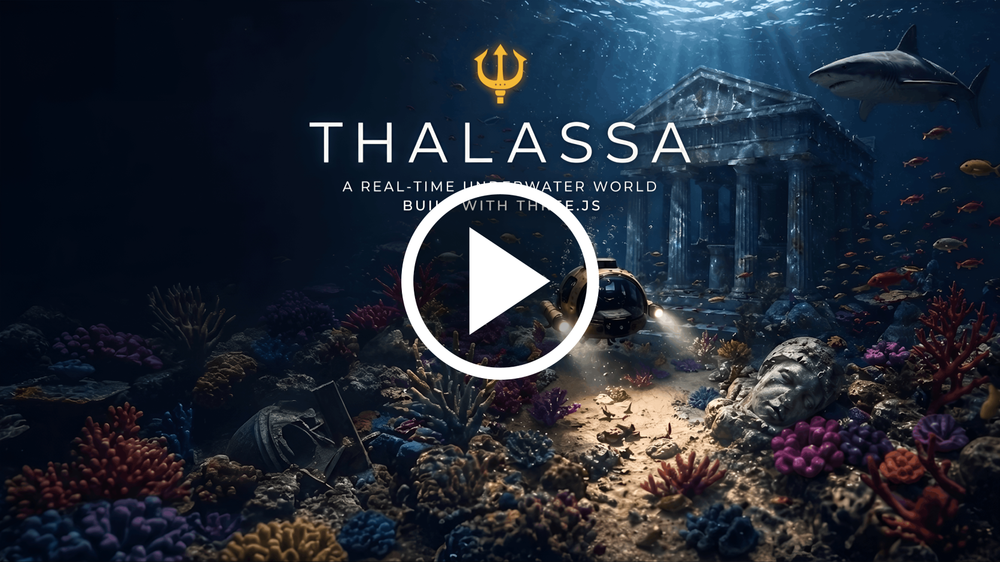
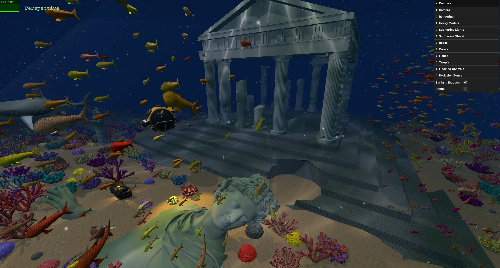
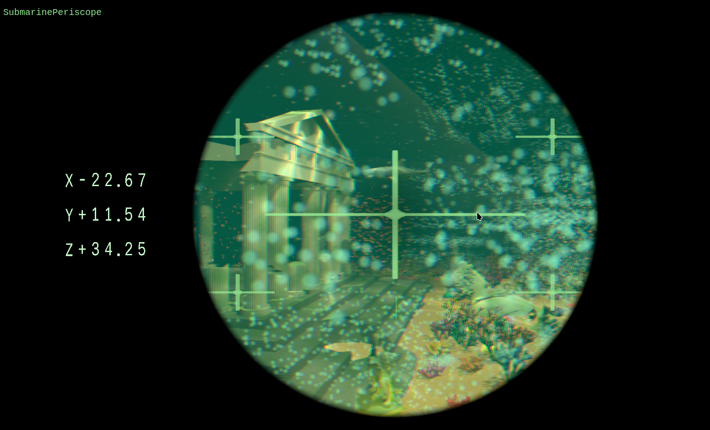
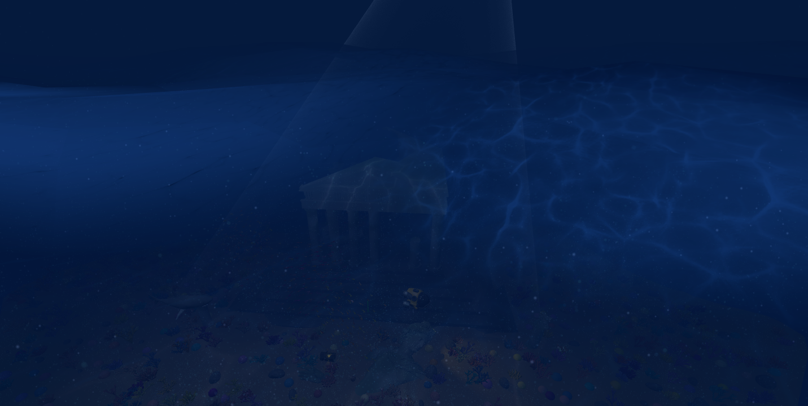
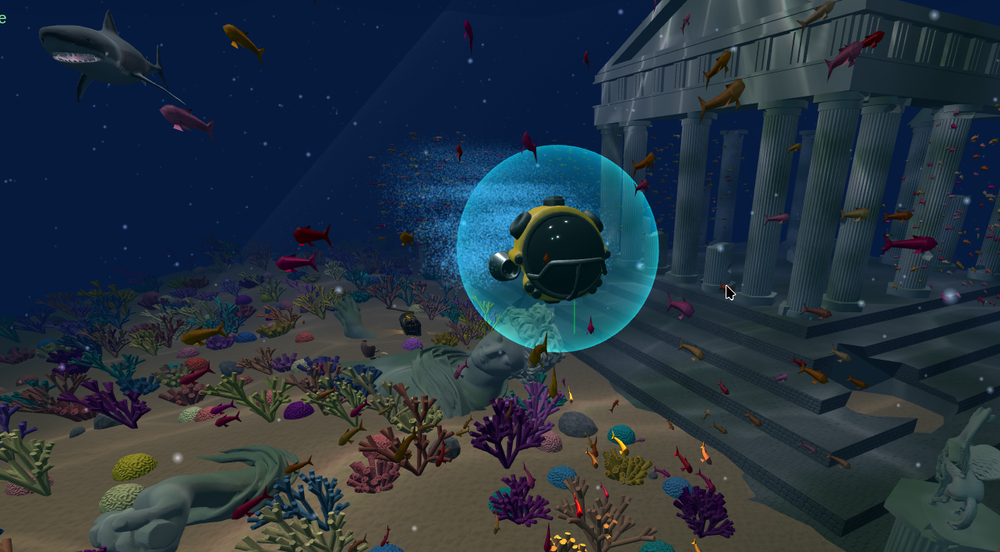
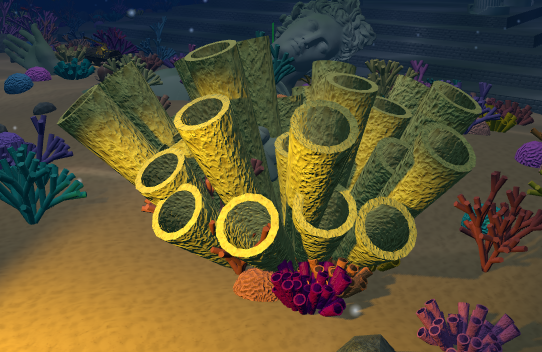
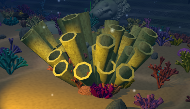
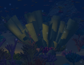
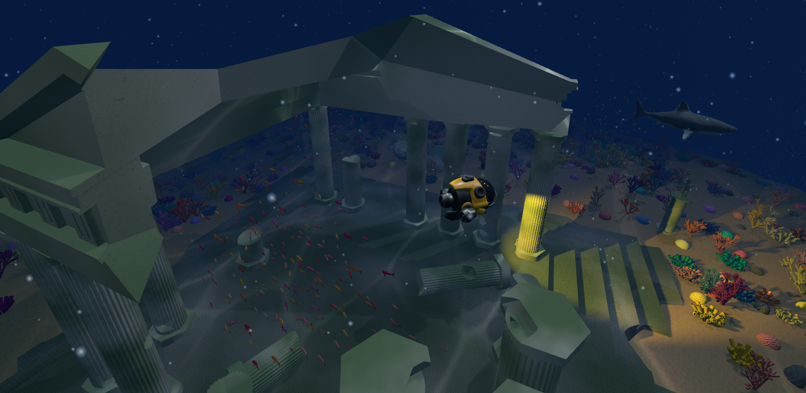
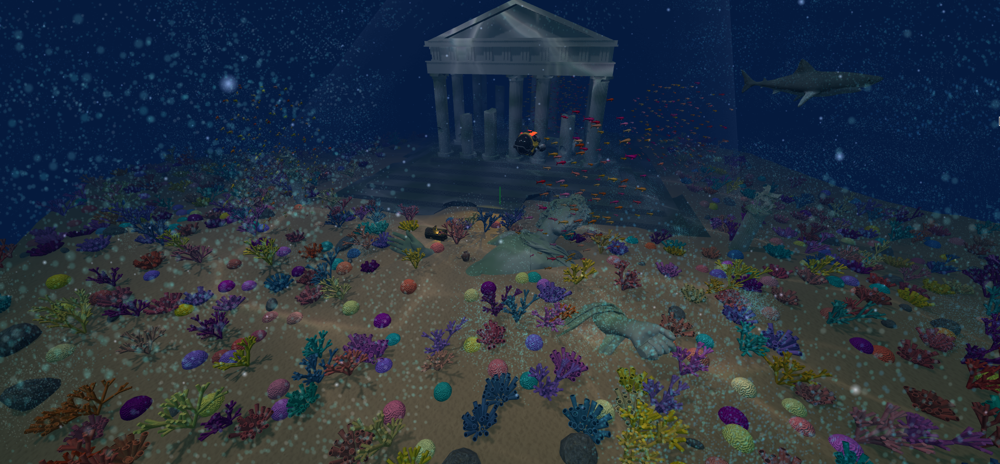

# Thalassa θάλασσα

 
Explore a sunken ancient temple, navigate through corals, evade a lurking shark, and witness dynamic caustics, fog, and marine life.

---

## Group: T05G05

| Name          | Number    | E-Mail             |
| ------------- | --------- | ------------------ |
| Bruno Huang   | 202207517 | up202207517@up.pt  |
| Pedro Gorobey | 202210292 | up202210292@up.pt  |
| Ricardo Yang  | 202208465 | up202208465@up.pt  |

----
## Project information

Our project aimed to push the limits of what could be rendered on today's average computer. As such, don't expect flawless performance.

## Scene

### Elements
- A temple
  - A main model along with an apollo statue, two horse pillars, a vase and a chest
- 850 corals of 3 types:
  - BrainCoral: A sphere-like coral with interconnected fissures
  - TubeCoral: A group of tubes placed in a radial manner
  - LSystemCoral: Built using a Stochastic L-System. Also has a swaying animation using shaders
- 100 rocks
- A submarine with a front (yellowish) light, and a red intermittent light
- 5 flocks of fish with 100-200 fish each
- A shark
- Animated water surface ([image](#scene-viewed-from-above-the-water-surface))

### Effects
- Bubbles emitted by tube corals (in bursts) and by submarine (when moving)
- "Marine snow": slow-falling particles spread across the entire scene
- Fog
- Caustic effect

### Features
- Flock avoidance ([image](#fish-swimming-away-from-submarine))
  - The submarine and shark are considered a danger and strongly avoided
  - Corals are also avoided, though not as strongly
- Collisions
  - Slide on collision to allow smooth movement
  - Submarine collides with temple, terrain and corals
  - Fish collide with temple and terrain
- Sand "puff" when the user clicks on the terrain
- Corals, fish and rocks increase in size when clicked
  - Good for seeing LOD in action ([image](#different-lods-visible-when-increasing-coral-size-clicking))
- 4 (relevant) camera modes:
  - Perspective: the default camera
  - Submarine Periscope ([image](#periscope-camera-mode)) with a cool visual effect and coordinates indicator
  - Submarine FPV with a video
  - Fly mode, with blurred vision
- Submarine shield
  - Affects collisions

----
## Issues/Problems

### Solved
- Multiple coral/fish meshes occupy a lot of memory and cause many draw calls, and THREE.InstancedMesh is pretty limiting
  - Solution: Three.ez's InstancedMesh2: very good abstraction that lets you handle instances almost like normal objects, allowing even complex cases like custom shaders (LSystemCoral) and skinning (Fish)

- ~5000 bubble groups on the scene (each tube coral burst generates multiple groups), each generated and rendered separately. Same problem as above, but can't even use InstancedMesh2 because it expects meshes (triangles)
  - Solution: Our own instancing implementation using InstancedBufferGeometry

### Unsolved

- **Bubble LOD and culling**
  - After switching to instancing, each instance shares the same, fixed number of particles (vertices). This means that, no matter what, each particle has to be rendered.
  - To mitigate this problem, each instance is given an "effective count" of particles and the rest of them are skipped. However, this barely causes any performance improvement (even for a high count of particles per instance), as it only really avoids generating fragments.
  - Similarly, culling is also a problem: we had to disable frustum culling, because otherwise particles would be culled if the camera turned its back to the scene origin (0,0,0)
  - **Potential Solution**: subdivide the particle system into different areas/clusters (uniform grid?) and apply LOD/culling per area/cluster, rather than per instance

- **Shadows**: Heavy models (e.g. temple, shark) don't have a dedicated shadow mesh/LOD

- **Temple Generation Time**
  - If you run our project, you will notice it takes a couple (or even a few) seconds to load the scene. This is because the temple is generated using boolean operations on geometries, which take quite a while.
  - **Potential Solution**: use workers
  - **Potential Solution**: generate temple beforehand

- **Collisions**
  - Objects can get stuck on edges and/or complex surfaces
    - Especially annoying for fish, because they don't just pick another direction, unlike the submarine which is controlled by the user
  - Was mitigated by making the surface normal stronger, but the issue is still prevalent and slide is not as smooth

## Extra screenshots

### Periscope camera mode

---

### Scene viewed from above the water surface

---

### Fish swimming away from submarine

---

### Different LODs visible when increasing coral size (clicking)

---

### A better look at the temple

---

### A longer shot of the scene

## Conclusions

very cool project

---
@SGI-2526-T05G05
